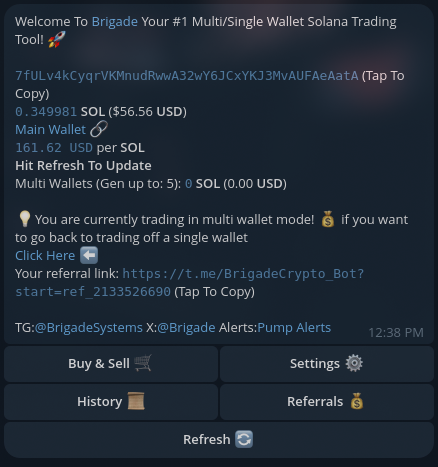

# 💳 Wallet Menu

<figure><figcaption></figcaption></figure>

## Send Sol to fund

This button will empty all the sol in that's sitting in your buy wallets back to your funding wallet so its easier to manage&#x20;

## Show Balance/ Hide Balance

Show Balance will display the total sol balance of all buy wallets. To refresh the amount click hide balance and show again and Total sol balance will be updated!

## Show Private Keys/ Hide Private Keys

Show Private Keys will display all the private keys of every buy wallet you have if you want to import them to phantom or save them for later. Hide Private Keys will go back to the default mode of just showing the address of all wallets&#x20;

## Upgrade Buy Wallets

You can upgrade the amount of buy wallets you have access to anytime you want in the wallet menu we currently only offer 4 tiers. Once upgraded the prices for the next tiers prices will change with the difference if you choose to go up another tier another time

* BASE - 5 Buy Wallets
* Tier 1 - 10 Buy Wallets (4 Sol)
* Tier 2 - 15 Buy Wallets (6 Sol)
* Tier 3- 25 Buy Wallets (8 Sol)

<figure><figcaption></figcaption></figure>

