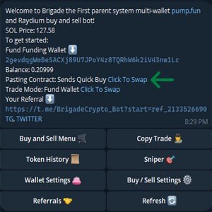

# Pasting Contract Setting

<table data-header-hidden data-full-width="true"><thead><tr><th width="727"></th><th></th></tr></thead><tbody><tr><td>In the main menu there's a hyperlink text "Click To Swap" right next to text that displays Pasting Contract: [Mode]         </td><td></td></tr></tbody></table>

### Auto Buy Mode

* Pasting a contract address will submit an auto buy transaction based on the settings set up in the Auto Buy / Auto Sell menu that under Buy / Sell Settings menu
* Can also paste in pump.fun links as well not just limited to pasting the contract address speed is Brigades #1 asset

### Open Transaction Menu

* Instead of submitting an auto buy with the settings selected when this mode is activated pasting a contract to the bot will now instead open the trade menu for the user so the can have more control over the buy or sell transactions
* As above this also works for pump.fun links
