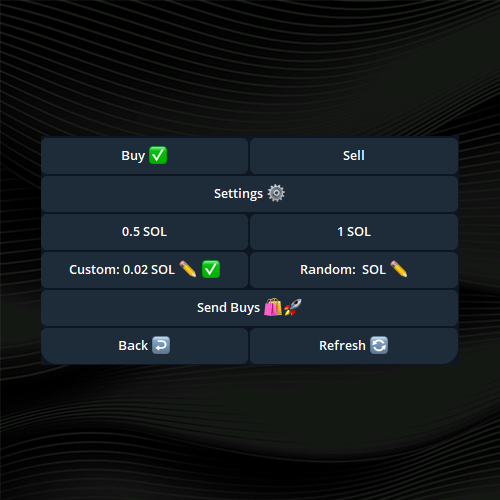
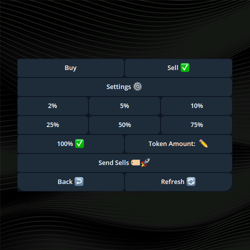
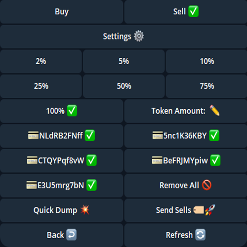
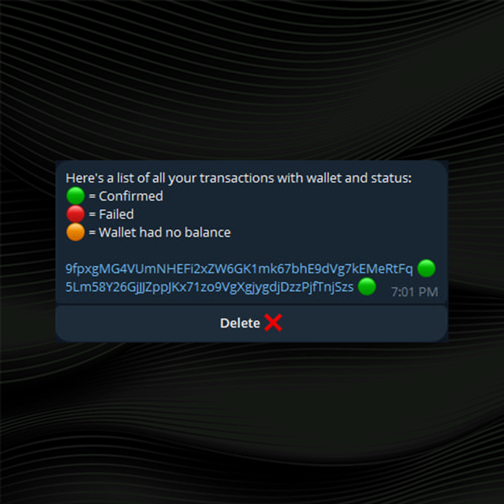

# 💸 Transaction Menu

* **Contract Address Input**: Enter the token’s contract address to access trading options.

<table data-header-hidden data-full-width="true"><thead><tr><th width="523"></th><th width="355"></th></tr></thead><tbody><tr><td><h2><strong>Fund Wallet Mode:</strong></h2></td><td></td></tr><tr><td>
<strong>Buy Options</strong>:

<strong>Preset SOL Amounts</strong>: Choose from preset options (e.g., 0.5 SOL, 1 SOL).

<strong>Custom Amount</strong>: Set a specific amount of SOL for purchasing.

<strong>Random Amount</strong>: The bot can automatically select a random buy amount within a specified range (e.g., 0.1 to 0.5 SOL).

<strong>Submit Buys</strong>: Directly execute trades from the fund wallet without selecting multiple wallets.
</td><td></td></tr><tr><td>
<strong>Sell Options</strong>:

<strong>Preset Sell Percentages</strong>: Choose from preset percentages of your token balance (e.g., 2%, 5%, 10%, 25%, 50%, 75%, 100%).

<strong>Custom Token Amount</strong>: Enter a specific number of tokens to sell.

<strong>Submit Sells</strong>: Directly execute trades from the fund wallet without selecting multiple wallets.
</td><td></td></tr><tr><td><h2><strong>Buy Wallet Mode:</strong></h2></td><td></td></tr><tr><td>
<strong>Buy Options</strong>:

<strong>Preset SOL Amounts</strong>: Choose from preset options (e.g., 0.5 SOL, 1 SOL).

<strong>Custom Amount</strong>: Set a specific amount of SOL for purchasing.

<strong>Random Amount</strong>: The bot can automatically select a random buy amount within a specified range (e.g., 0.1 to 0.5 SOL).

<strong>Submit Buys</strong>: Directly execute trades from the fund wallet without selecting multiple wallets.

<strong>Submit Buys</strong>: Executes the trade across all selected wallets simultaneously. Brigade’s custom methods ensure the transaction speed remains consistent across multi wallets vs submitting a transaction on one wallet.
</td><td></td></tr><tr><td>
<strong>Sell Options</strong>:

<strong>Preset Sell Percentages</strong>: As with Fund Wallet Mode, choose from preset sell percentages.

<strong>Custom Token Amount</strong>: Enter the number of tokens to sell.

<strong>Quick Dump</strong>: This special option allows users to consolidate all SPL tokens from all buy wallets that have a SPL balance into a single wallet and then execute a sell order. This feature is useful for quickly exiting trades while minimizing slippage.

<strong>Submit Sells</strong>: Executes the trade across all selected wallets simultaneously. Brigade’s custom methods ensure the transaction speed remains consistent across multi wallets vs submitting a transaction on one wallet.
</td><td></td></tr><tr><td>
<strong>Transaction Status Updates</strong>: 

After submitting a trade, the bot will update with transaction IDs and statuses (e.g., confirmed, failed, or no balance). Users can refresh to update their wallet balances and unrealized PNL to be shown in the transaction menu.
</td><td></td></tr></tbody></table>
